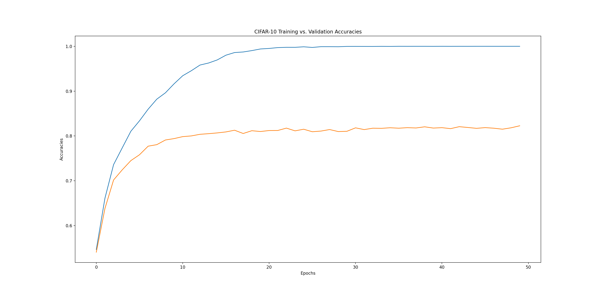

<h1 align="center">School Projects</h1>
Here lies a journal of school coding projects and assignments I have completed at UC Berkeley. Since I can't share the source code of the projects, I'll summarize the projects and what I learned from them instead. I'll also include a link to the project spec if possible. Having a journal like this helps me keep track of the most notable projects I've completed at Berkeley!
  
Here are all the CS courses I've completed so far, for reference:
<blockquote>
CS 61A: <a href="https://cs61a.org/">The Structure and Interpretation of Computer Programs</a>  
CS 61B: <a href="https://sp21.datastructur.es/">Data Structures and Algorithms</a>  
EECS 16A: <a href="https://eecs16a.org/">Designing Information Devices and Systems I</a>  
CS 188: <a href="https://inst.eecs.berkeley.edu/~cs188/fa22/">Introduction to Artificial Intelligence</a>  
CS 61C: <a href="https://inst.eecs.berkeley.edu/~cs61c/fa21/">Great Ideas in Computer Architecture (Machine Structures)</a>  
CS 70: <a href="https://www.eecs70.org/">Discrete Mathematics and Probability Theory</a>  
CS 198: <a href="https://mlberkeley.github.io/rec-sys-decal-website/#/syllabus">Recommendation Systems in Machine Learning</a>  
EECS 16B: <a href="https://eecs16b.org/">Designing Information Devices and Systems II</a>  
CS 189: <a href="https://www.compsci189.org/">Introduction to Machine Learning</a>  
DATA 100: <a href="https://ds100.org/fa22/">Principles and Techniques of Data Science</a>  
CS 162: <a href="https://cs162.org/">Operating Systems and Systems Programming</a>  
</blockquote>

<h2 align="center">Hog</h2>

    <a href="https://cs61a.org/">CS 61A</a> - Fall 2020

    

My first CS project at UC Berkeley where I was exposed to functional programming and Python. Implemented a made up dice game of Hog. GUI was done in Tkinter.

    <a href="https://inst.eecs.berkeley.edu/~cs61a/sp19/proj/hog/">Spec</a>

    

<h2 align="center">Yelp Maps</h2>

    

A project where I was exposed to the list comprehensions, data structures, and data abstractions. Created a Voronoi diagram of reccomendations overlaying on the map of Berkeley campus! It used simple machine learning algorithms such as centroid method and k-means clustering algorithm to reccomend restaurants based on Yelp Academic Dataset. Overall, gave a taste of supervised/unsupervised learning and peaked my interest in AI/ML. 

    <a href="https://inst.eecs.berkeley.edu/~cs61a/sp19/proj/maps/">Spec</a>

    

<h2 align="center">Ants vs. Bees</h2>

    

This project exercised object oriented programming with a fun little web app game inspired by the popular mobile tower defense game classic: Plants vs. Zombies. Dealt with classes, super classes, methods, attributes, and much much more to develop a fully working game!

    <a href="https://inst.eecs.berkeley.edu/~cs61a/sp19/proj/ants/">Spec</a>

    

<h2 align="center">Scheme Interpreter</h2>

    

Built a full interpreter in Python for Scheme. The program fully replicates the REPL environment of Scheme. This was a really cool project building a functional programming language and interpreter from scratch with an already interpreted lanugage!

    <a href="https://inst.eecs.berkeley.edu/~cs61a/sp19/proj/scheme/">Spec</a>

    

<h2 align="center">NBody</h2>

    

    <a href="https://cs61bl.org/su20/projects/nbody/">Spec</a>

Made an Nbody simulator. Using physics equations to simulate bodies in space using StdDraw, this was a small project intended to get hands dirty with Java. 

    

<h2 align="center">ArrayDeque</h2>

    

    <a href="https://cs61bl.org/su20/projects/deques/">Spec</a>

Made an array deque data structure from scratch in Java. Also implemented unit tests with junit5. It was the first time using a testing framework and an introduction to TDD.

    

<h2 align="center">Gitlet</h2>

    

    <a href="https://cs61bl.org/su20/projects/gitlet/">Spec</a>

A Git clone made in Java using SHA-1 serialization and basic data structures. Can do basic version control system through the command line such as init, add, commit, log, find, status, branch, checkout, merge, rebase, push, pull, etc. Made unittests with junit5, as well as integration tests with Python automating shell scripts/Gitlet commands. It was a great project to understand how Git works.

    

<h2 align="center">BearMaps</h2>

    

    <a href="https://cs61bl.org/su20/projects/bearmaps/">Spec</a>

Created a mini web map application deployed on Heroku using OpenStreetMap of Berkeley. Application uses data structures and algorithms such as tries, hashing, A* shortest path, rasterizing, and KD-trees. Integrated unittests with junit5. Website is availiable to view by clicking on the image below!

    

<h2 align="center">Game of Life</h2>

    

    <a href="https://cs61c.org/fa20/projects/proj1/">Spec</a>

Implemented John Conway's Game of Life in C through bit manipulations to produce bitmap images and movies. Uses shell scripts to make movies out of image frames, as well as testing. It was also my first project in C, so I learned how to meticulously bug with gdb and check for memory leaks with Valgrind. Made some pretty cool movies with this project!

    

<h2 align="center">RISC-V Classify</h2>

    

    <a href="https://cs61c.org/fa20/projects/proj2/">Spec</a>

Made an artificial neural network in RISC-V assembly. Uses Venus, a Java backend RISC-V simulator to run assembly code. Matrix and vector operations were implemented such as ReLU, argmax, and matrix multiply. Can train and classify MNIST digit dataset with greyscale images mapped with values from 0 to 255 of size 28x28 (was restircted to the integer instruction set). Uses Python unittest library to run unit and integration tests in conjucttion with the Venus simulator. Also uses bash scripts to automate development/testing workflow. It was my first project in assembly, so it was cool to see how to convert such a high level mathematical algorithm down to an option of 47 instructions that a CPU understands!

    

<h2 align="center">RISC-V CPU</h2>

    

    <a href="https://cs61c.org/fa20/projects/proj3/">Spec</a>

Designed a CPU with datapath, control logic, and memory fully implemented in Logisim following the RISC-V 32-bit ISA. Design scored top 100 out of 1200+ students based on how many logic gates were efficiently used. Uses Venus, a Java backend RISC-V simulator to convert assembly code to machine code and input it into Logisim. Uses Python and bash scripts to automate assembling, execution, integration tests, and development workflow. Overall, was really cool to design an actual working (virtualized) CPU and also see it run previous projects/code in RISC-V.

    

<h2 align="center">Numc</h2>

    

    <a href="https://cs61c.org/fa20/projects/proj4/">Spec</a>

Made a NumPy library clone in C. Used SIMD and MIMD to accelerate matrix operations, with frameworks such as Intel AVX Intrinsics and OpenMP, as well as optimizations with caches and virtual memory. Benchmarked 110X speed up in DGEMM and 2200X in matrix exponentiation on an Intel i7-4770 processor. Scored on average top 100 out of 1200+ students out of multiple categories, scored top 10 in matrix unary/binary operations category. Uses Python C interface/API to connect C code to Python, as well as using Python unittests and CUnit testing framework to do unit and integration tests. Uses bash script to automate compilation, testing, and development workflow. This was one of the most rewarding projects, as I had to understand how the compiler works down to instuction level and got to see code drastically run faster!

    

<h2 align="center">Pacman AI</h2>

    

    <a href="https://inst.eecs.berkeley.edu/~cs188/fa20/projects/">Spec</a>

Encoded a series of AI functionality to the game of Pacman in Python, such as searching algorithms, gametrees, MDPs, reinforcement learning, and Bayesian networks. Scored 5th for best AI agent out of 600+ students. Overall, very fun projects, and maybe even philosophical. It was interesting to see simple algorithms map to simulating intelligence.

    

<h2 align="center">Neural Networks</h2>

    

    <a href="https://inst.eecs.berkeley.edu/~cs188/fa20/project5/">Spec</a>

Created neural networks from scratch to estimate sine wave, classify digits, and classify different languages. It was very hard to code, but the reward of achieving high accuracy peaked my interesting in machine learning!

    

<h2 align="center">Discrete Mathematics and Probability Homework</h2>

    

Wrote up homework solutions through LaTeX and visualized problems with Python. 

<h2 align="center">Algorithms Homework</h2>

    

Programmed algorithms in Python and wrote homework solutions in LaTeX.

<h2 align="center">Zoom Rooms</h2>

    

    <a href="https://github.com/Berkeley-CS170/project-fa20-skeleton">Spec</a> 
    <a href="https://berkeley-cs170.github.io/project-leaderboard-fa20/">Public Leaderboard</a>

Devised algorithms to solve a NP-Hard of graph parititioning problem. Uses NetworkX to generate and compute graphs. It was hard to try to generalize, but found a way to brute force small graphs to achieve first place on the leaderboard, and then devise a greedy algorithm to score on average top 50% of the leaderboard for medium and large graphs!

    

<h2 align="center">Kaggle InClass Prediction Competition</h2>

    

Scored on average top 5% of the class in Kaggle InClass Prediction Competitions for a machine learning course consisting of 600+ graduate and undergraduate students. Competed for the best classifiers such as SVMs, GDA, Logistic Regression, Decision Trees/Random Forests, and Neural Networks developed from scratch in Python. Trained and classified datasets like MNIST Digits, MNIST Fashion, Spam/Ham, CIFAR-10, wine, Titanic, movie datasets. Uses libraries such as NumPy, Pandas, SciPy, Matplotlib, and sklearn to help with data preprocessing and numerical computations. Wrote homework solutions in LaTeX as well as coding in Jupyter notebook environment. Overall, had fun with deriving math problems/algorihtms and implementing them in code to be rewarded with high classification accuracy!

    

<h2 align="center">SIXT33N Voice Activated Self-Driving Car</h2>

    

Made a self-driving car with circuits, op-amps, filters, and sensors with a TI MSP-EXP430F5529LP microcontroller. Software is written in C++ and can recognize four voice commands corresponding to four actions. Commands are classified with unsupervised learning technique using principal components analysis.

    

##
<h2 align="center">Data Science Homework</h2>

    

Completed a series of homework related to data science. Involved the full data science lifecycle, from data cleaning, making visualizations, evaluating models, and reasoning the data. Got hands dirty with a variety of machine learning/data science packages such as Pandas, Numpy, Matplotlib, scikit-learn, Seaborn, Scipy, and Plotly.

##
<h2 align="center">Pintos</h2>

    

Improved upon the Pintos operating system written in C by implementing support for system calls, FPU, timers, schedulers, user threads, buffer cache, filesystem, and subdirectories.

    

##
<h2 align="center">Secure Filesystem</h2>

    

Implemented a filesystem in Go with secure cryptographic encryption schemes that ensure confidentiality, authenticity, and integrity of data. Wrote security attacks and tests with Ginkgo and Gomega testing frameworks. Used cryptographic functions such as public key encryption, digital signatures, hash-based message authentication code (HMAC), hash-based key derivation function (HashKDF), password-based key derivation function (PBKDF), and symmetric encryption.

    

##
<h2 align="center">Parallel Computing Homework</h2>

    

Series of parallel computing homeworks written in C/C++. Used SIMD instructions to achieve near theoretical peak performance of DGEMM on a single core on Intel KNL processors. Parallelized particle simulations using OpemMP, MPI, and CUDA. Finally, used UPC++ to do genomic simulation. Ran CPU simulations and benchmarks on Cori KNL nodes (Intel Xeon Phi 7250) on the NERSC supercomputer (<a href="https://www.top500.org/lists/top500/">Top 500</a>) and ran GPU simulations on Bridges-2 supercomputer in PSC (8 NVIDIA Tesla V100 32GB per node). 

    

##
<h2 align="center">Computer Architecture Labs</h2>

    

Series of computer achitecture labs written in C/C++/RISC-V assembly. Used Chisel to write hardware descriptive code and Chipyard framework to run variety of RISC-V simulators. 

