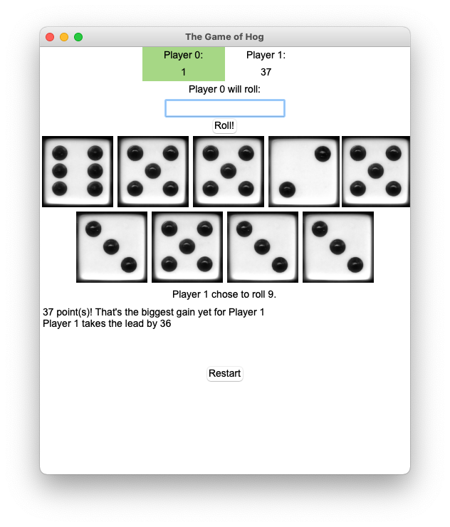
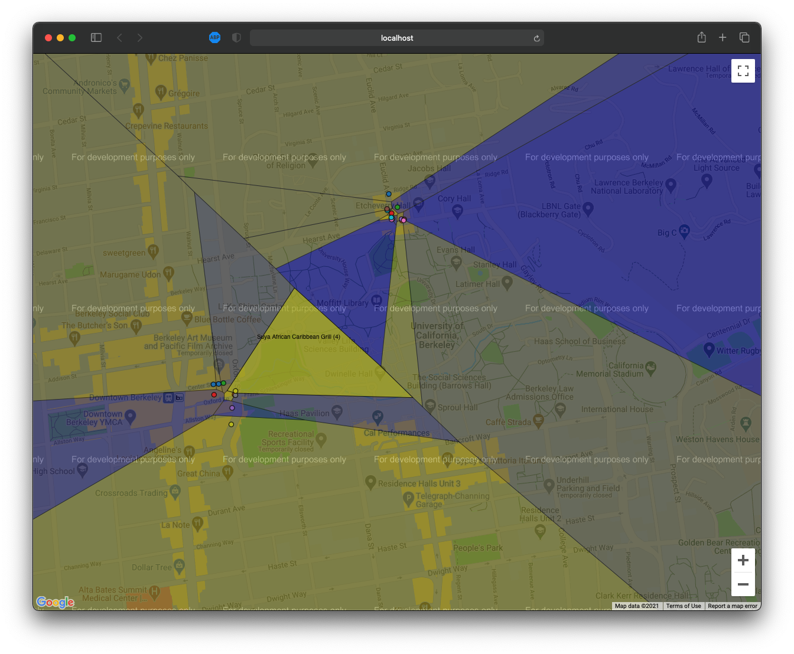
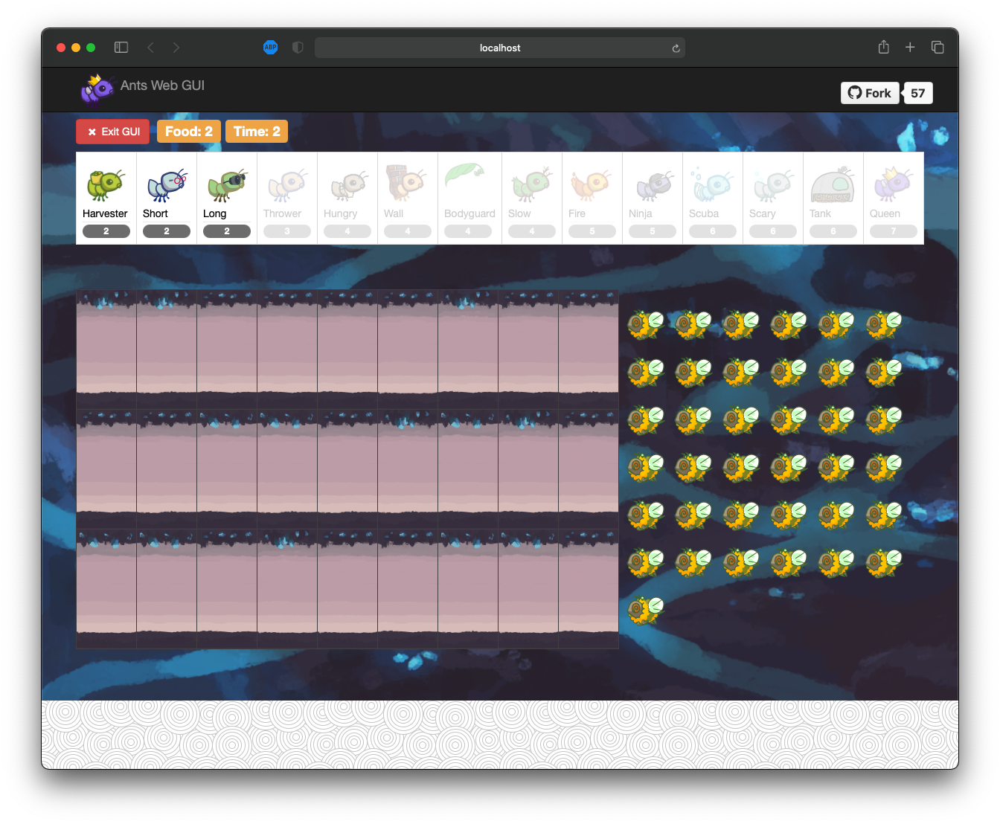
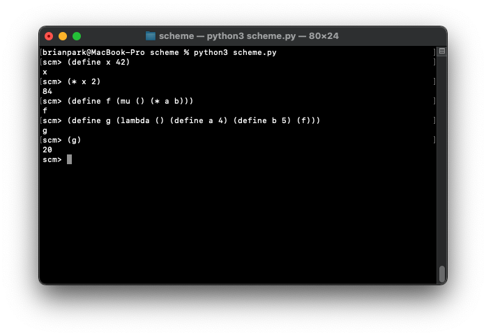
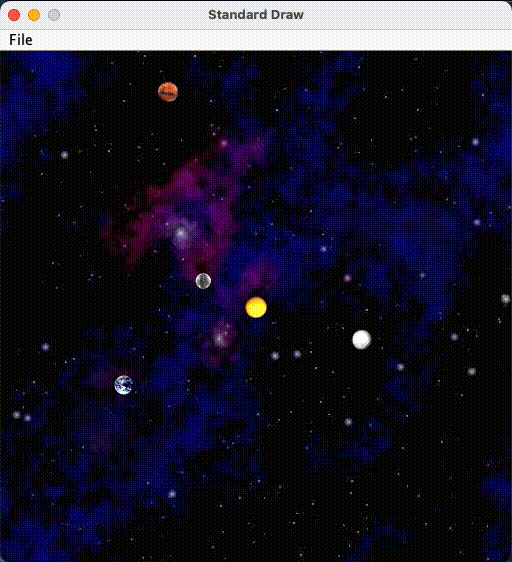
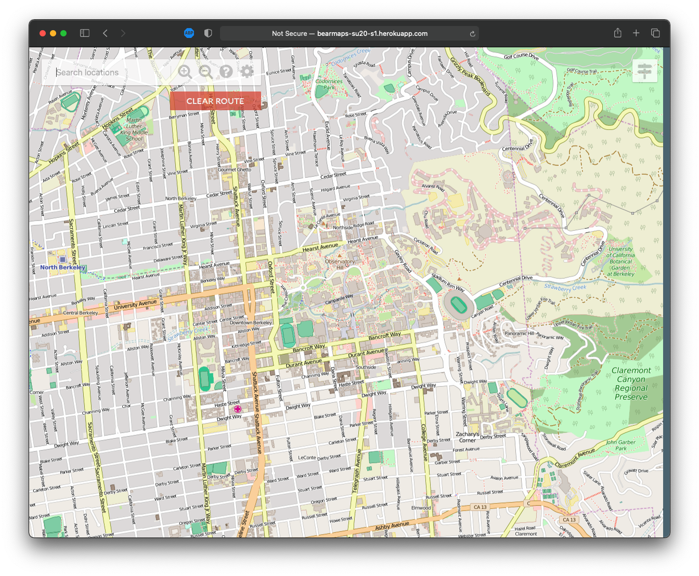
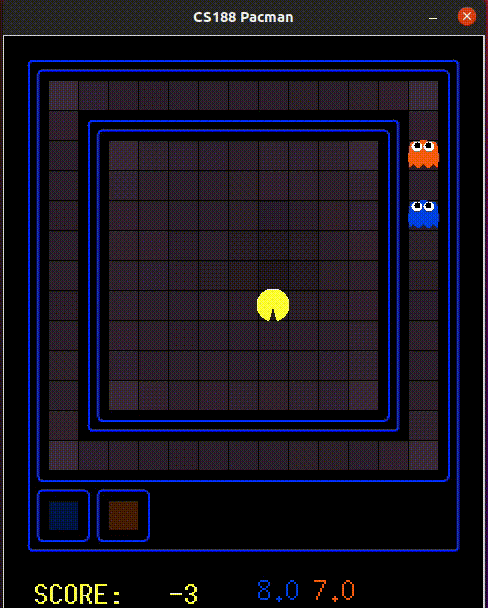
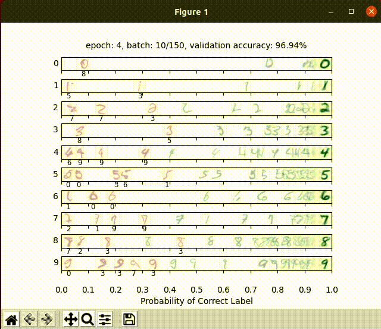
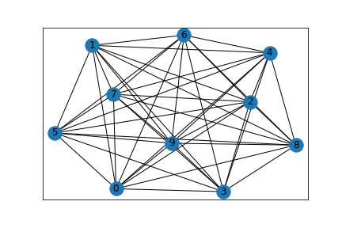

# School Projects
Here lies a journal of school coding projects and assignments I have completed at UC Berkeley. I cannot share the source code of the projects because of confidentiality and plagarism, so I will summarize my thoughts and findings here instead. If possible, I will also include a link to the project spec. Having a journal like this helps me keep track of the plethora of projects I've completed!

## Hog
My first CS project at UC Berkeley where I was exposed to functional programming and Python to a made up dice game of Hog. GUI was done in Tkinter. [Spec](https://inst.eecs.berkeley.edu/~cs61a/sp19/proj/hog/)

## Yelp Maps
A project where I was exposed to the list comprehensions, data structures, and data abstractions. Created a Voronoi diagram of reccomendations overlaying on the map of the campus! It used simple machine learning algorithms such as centroid method and k-means clustering algorithm! [Spec](https://inst.eecs.berkeley.edu/~cs61a/sp19/proj/maps/)

## Ants vs. Bees
This project exercised object oriented programming with a fun little web app game inspired by the popular mobile classic: Plants vs. Zombies. [Spec](https://inst.eecs.berkeley.edu/~cs61a/sp19/proj/ants/)

## Scheme Interpreter
Built a full interpreter in Python for Scheme. The program fully replicates the REPL environment of Scheme. This was a really cool project building a functional programming language and interpreter from scratch with an interpreted lanugage! [Spec](https://inst.eecs.berkeley.edu/~cs61a/sp19/proj/scheme/)

## NBody
Made an Nbody simulator. [Spec](https://cs61bl.org/su20/projects/nbody/)

## ArrayDeque
Made an array deque data structure from scratch in Java. [Spec](https://cs61bl.org/su20/projects/deques/)

## Gitlet
Made a fully functional mini version control system in Java. [Spec](https://cs61bl.org/su20/projects/gitlet/)

## BearMaps
Created a mini web map application using OpenStreetMap of Berkeley. Application uses data structures and algorithms such as tries, hashing, A* shortest path, rasterizing, and KD-trees. [Spec](https://cs61bl.org/su20/projects/bearmaps/)

*Click on the image for the interactive website!*

## Game of Life
Implemented John Conway's Game of Life in C through bit manipulations to produce bitmap images and movies. [Spec](https://cs61c.org/fa20/projects/proj1/)

## RISC-V Classify
Made an artificial neural network in RISC-V assembly. Matrix and vector operations were implemented such as ReLU, argmax, and matrix multiply.

Uses the Python unittest library. [Spec](https://cs61c.org/fa20/projects/proj2/)

## RISC-V CPU
Made a RISC-V CPU in Logisim. Testing was done through Python and Bash scripts. [Spec](https://cs61c.org/fa20/projects/proj3/)

## Numc
Made a numpy clone in C. Uses SIMD and MIMD (specifically Intel Intrinsics and OpenMP) to accelerate matrix operations such as add, subtract, absolute value, and negation. Also sped up DGEMM to a factor of 110X and matrix exponentation to a factor of 2200X. Optimizations with caches were also performed to achieve such a great speedup. This was tested on the Intel i7-4770 processor. [Spec](https://cs61c.org/fa20/projects/proj4/)

## Pacman AI
Implemented a series of AI functionality to Pacman such as searching algorithms, gametrees, Markov Decision Processes, reinforcement learning, Bayesian Networks, HMMs, and particle filtering. [Spec](https://inst.eecs.berkeley.edu/~cs188/fa20/projects/)

## Neural Networks
Created neural networks from scratch to estimate sine wave, classify digits, and classify different languages. [Spec](https://inst.eecs.berkeley.edu/~cs188/fa20/project5/)

## Zoom Rooms
Devised algorithms to solve a NP-Hard of graph parititioning problem. Ended up devising a greedy algorithm. 
[Spec](https://github.com/Berkeley-CS170/project-fa20-skeleton)
[Public Leaderboard](https://berkeley-cs170.github.io/project-leaderboard-fa20/)

## Discrete Mathematics and Probability Homework
Wrote up homework solutions through LaTeX and visualized problems with Python.

## Algorithms Homework
Programmed algorithms in Python and worked out homework problems in LaTeX.

